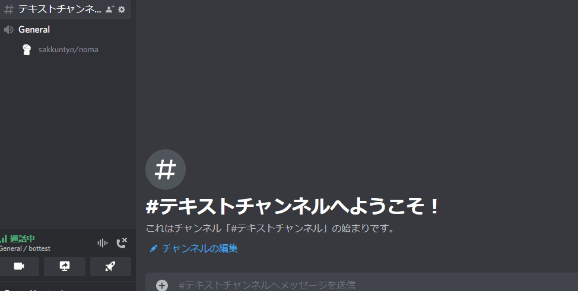

# 再生してくれるBot

[招待リンク](https://discord.com/api/oauth2/authorize?client_id=889584860308570113&permissions=3147904&scope=bot)

## 目的

- ?

## 動作環境

- ubuntu 20.04 (Azure VM)
  - nodejs 14.17.6
    - discord.js 12.3.0

## 動き概要

1. Discordでボイスチャンネルに入っている人から!spで始まるメッセージを受け取る
2. 再生する

## 使い方



### 再生

```
!sr (<play> or <p>) (<URL> or <keyword>)
```

### ボイスチャンネルから退出

注意：これをしないと退出しません

```
!sr (<disc> or <d>)
```

### キューを表示

```
!sr (<queue> or <q>)
``` 

### 次の曲を再生

```
!sr (<skip> or <s>)
```

## 起動方法

```
# nodejsのインストール
$ git clone https://github.com/creationix/nvm ~/.nvm
$ source ~/.nvm/nvm.sh
$ echo "source ~/.nvm/nvm.sh" >> ~/.bashrc
$ nvm install 14.17.6
$ nvm use 14.17.6

# このアプリの起動
$ git clone https://github.com/sakkuntyo/discord-pero
$ cd discord-pero
$ sed "s/<discordtoken>/ここにdiscordのトークンを入れる/g" -i settings.json
$ npm install //失敗します
$ sudo apt install build-essential -y
$ npm config set python /usr/bin/python2.7
$ npm install //成功します
$ sudo apt install ffmpeg -y //音声の変換処理に使います。
$ npm start

# デーモンにしたい場合、pm2を使う
$ npm install -g pm2
$ pm2 start index pero
## OSの起動と同時に起動
$ pm2 startup
## 現在のpm2 listの状態を保存
$ pm2 save
```

## [Discord Developer Portal](https://discordapp.com/developers/)でする事

### 1.アプリケーション作成

### 2.Bot設定ページのBUILD-A-BOTにある Add Bot ボタンを押下

今後このページからBot設定を行う

### 3.OAuth2設定ページから招待リンクを作成してBotをチャンネルに追加する

- 必要なスコープ
  - bot
- 必要な権限
  - View Audiot Log
  - Connect
  - Speak
  - Send Messages *任意
  


### 4.tokenはBot設定ページの Click to Reveal Token をクリックして表示される物を使用する


## learning

- キュー管理
https://github.com/DS-Development/delet/blob/43edee301d51b3e1471cc59d279802ad9cad9d48/music/js/music.js#L195
